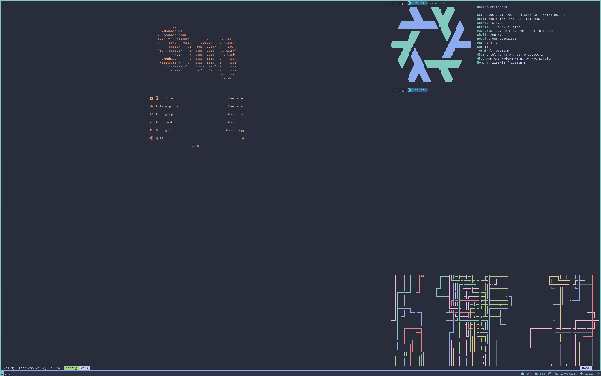

# .config



MacOS Install
```sh
curl https://raw.githubusercontent.com/DMJGilbert/.config/main/bootstrap.sh -sSf | bash
```

MacOS Rebuild
```sh
darwin-rebuild switch  --flake .
```

NixOS Rebuild
```sh
nixos-rebuild switch  --flake .
```

Update
```sh
nix flake update .
```

MacOS Nix update:
```
sudo -i sh -c 'nix-channel --update && nix-env --install --attr nixpkgs.nix && launchctl remove org.nixos.nix-daemon && launchctl load /Library/LaunchDaemons/org.nixos.nix-daemon.plist'
```

Formatting:
```
nix run nixpkgs#alejandra -- --check ./
```
